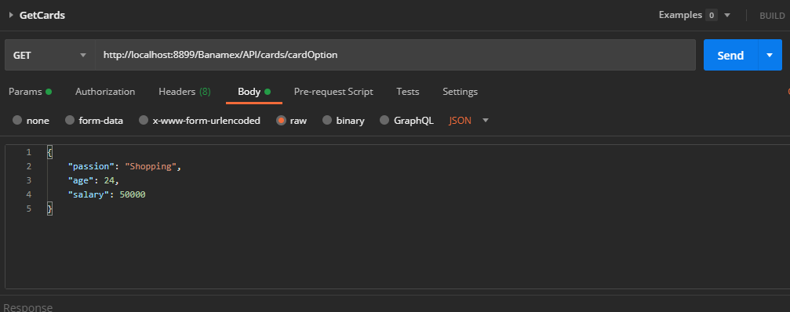

# Microservicio_ProyectoFinal_IBM
Repositorio de los microservicios desarrollados como parte del Proyecto Final de la academia de microservicios en IBM

# Para la API de Tarjetas de Credito
 
 Se encuetra en la carpeta API_Tarjetas  
	1.- Abre la carpeta EurekaServer y abre el proyecto en tu IDE  
	2.- Ejecuta la clase con el metodo main, espera hasta que haya cargado en la consola el mensaje "Aplication Initialized"  
	3.- En tu navegador ya estará dispoible la consola de Eureka en http://localhost:8761  
	4.- Ahora regresa a la carpeta raiz y abre la carpeta TarjetasAPI, abre el proyecto en tu IDE y ejecuta la clase con el metodo main  
	5.- Espera hasta que se muestre el mensaje "Application Initilized" en la consola  
	6.- Vuelve al navegador y ahora se mostrara desplegada la aplicación "TARJETAS_SERVICE" en el puerto 8899 del localhost  
	7.- Ahora abre Postman, crea una peticion GET con el url http://localhost:8899/Banamex/API/cards/cardOption  
	8.- En el body de la peticion coloca en formato JSON los datos a probar  
	
Ejemplo de Body:  
	

		
	
	

9.- Realiza la petición y listo.  

	
