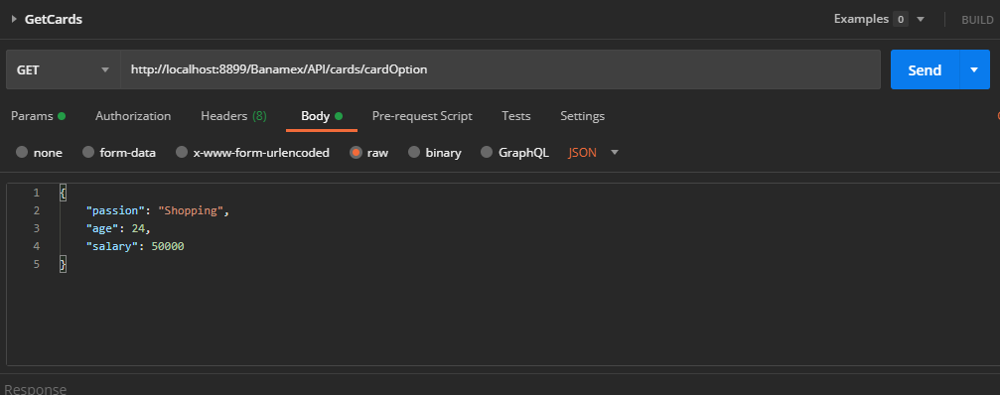
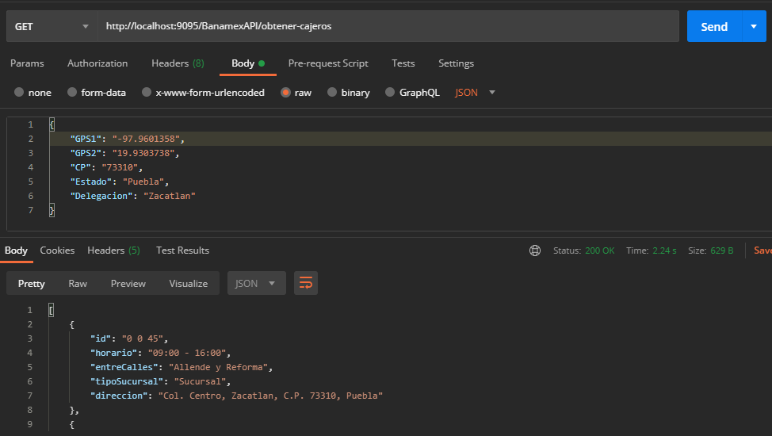
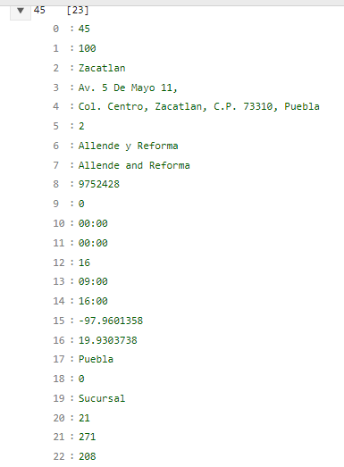

# Microservicio ProyectoFinal IBM

Repositorio de los microservicios desarrollados como parte del Proyecto Final de la academia de microservicios en IBM

# API de Tarjetas de Credito
----
Esta API se encarga de mandar el tipo de tarjeta de credito más optima para el perfil del usuario que la solicite, por medio de parámetros como su Pasión, su ingreso mensual y su edad.

#### Pasos a seguir
                
1. Abre la carpeta EurekaServer y abre el proyecto en tu IDE
2. Ejecuta la clase con el metodo main, espera hasta que haya cargado en la consola el mensaje "Aplication Initialized"
3. En tu navegador ya estará dispoible la consola de [Eureka]( http://localhost:8761 )
4. Ahora regresa a la carpeta raiz, abre la carpeta ConfigServer, abre el proyecto en tu IDE y ejecuta la clase con el metodo main y espera hasta que inicie la aplicación
5. Ahora regresa a la carpeta raiz y abre la carpeta API_Tarjetas/TarjetasAPI, abre el proyecto en tu IDE y ejecuta la clase con el metodo main
6. Vuelve al navegador y ahora se mostrara desplegada la aplicación "TARJETAS_SERVICE" en el puerto 8899 del [localhost]( http://localhost:8899 )
7. Abre Postman, crea una peticion GET con el endpoint `http://localhost:8899/Banamex/API/cards/cardOption`
8. En el body de la peticion coloca en formato JSON los datos a probar
                

### Ejemplo  de petición en Postman

> Peticion GET a API

 

# API de ATM y Sucursales
----
Esta API se encarga de obtener los ATM y Sucursales citiBanamex por medio de los paramétros de GPS, C.P, Estado, Delegación/Municipio. 

#### Pasos a seguir
                
1. Abre la carpeta EurekaServer y abre el proyecto en tu IDE
2. Ejecuta la clase con el metodo main, espera hasta que haya cargado en la consola el mensaje "Aplication Initialized"
3. En tu navegador ya estará dispoible la consola de [Eureka]( http://localhost:8761 )
4. Ahora regresa a la carpeta raiz, abre la carpeta ConfigServer, abre el proyecto en tu IDE y ejecuta la clase con el metodo main y espera hasta que inicie la aplicación
5. Ahora regresa a la carpeta raiz y abre la carpeta API_Cajeros/JSONCajeros, abre el proyecto en tu IDE y ejecuta la clase con el metodo main
6. Vuelve a la carpeta raiz y ahora abre la carpeta API_Cajeros/CajerosAPI, abre el proyecto en tu IDE y ejecuta la clase con el metodo main
7. Vuelve a tu navegador y donde abriste el servidor Eureka, estarán desplegados los servicios de los Cajeros
8. Se puede obtener el JSON de todos los cajeros con el servicio de API-CAJEROS-SERVICE con el endpoint `http://localhost:8890/Cajeros/get-cajeros`
9. Ahora para hacer una peticion al servicio NEAR_ATM_SERVICE, el cual nos dará los cajeros cercanos, abre Postman, crea una peticion GET con el endpoint `http://localhost:9095/BanamexAPI/obtener-cajeros`
10. En el body de la peticion coloca en formato JSON los datos a probar
                

### Ejemplo  de petición en Postman

> Peticion GET a API de Cajeros

#### Consideraciones de la API de Cajeros
Los datos del JSON obtenidos por citiBanamex con los que se hace la comparacion de los inputs del body del request son los siguientes:

* GPS1 - indice 15
* GPS2 - indice 16
* CP - indice 4 (Automático con substring)
* Estado - indice 17
* Delegacion - indice 2

Entonces se deben de colocar los datos especificos de estos indices para que funcione la API

### Ejemplo de los indices

> Indices del JSON de cajeros
